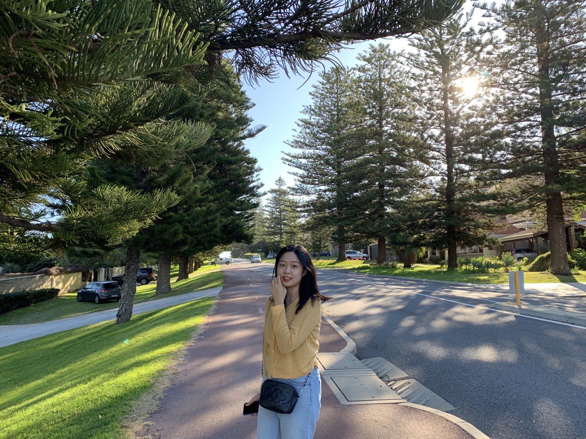

I am a MS student at Bioinformatics Laboratory led by Prof. Hyun-seok Park.   
My research interests include deep learning applications as well as natural language processing, especially in the biomedical domain.

## Interests

Bioinformatics, Natural Language Processing, and Machine Learning

## Research
**Linguistics Modelling of Non-coding DNA of Human Genome based on Annotations of Large-scale Epigenetics Projects**  

**Using the PubAnnotation Ecosystem to Perform Agile Text Mining on Genomics & Informatics** 
*`Travel Award`* `[paper](https://genominfo.org/upload/pdf/gi-2020-18-2-e13.pdf)`

**Trends in Genomics & Informatics: a Statistical Review of Publications from 2003 to 2018 Focusing on the Most-Studied Genes and Document Clusters** 
[paper](https://genominfo.org/upload/pdf/gi-2019-17-3-e25.pdf)

**Development of Machine Translation Algorithm for Aviation Industry Language based on Artificial Intelligence Neural Network**  

**GNI Corpus Version 1.0: Annotated Full-Text Corpus of Genomics & Informatics to Support Biomedical Information Extraction** 
[paper](https://genominfo.org/upload/pdf/gi-2018-16-3-75.pdf) 

**Multi-User Home-Training Healthcare System Using Kinect Sensor and Wearable Devices**  
*`Best Paper Award`*   
[paper](https://drive.google.com/file/d/1UOr8o4n1I96SHbNpzIr14przjWCwSnEy/view?usp=sharing) . [demo](https://www.youtube.com/watch?v=v5fK2L9En_w)

## Patent

**Supporting Method and System for Home Fitness** 
Hyungjune Lee, Da-Won Kim, Hee-Jo Nam, Seung-Yeon Lee, You-Kyung Haam.  
[link](https://doi.org/10.8080/1020180163201)

## Teaching Assistant

- Software-based Convergence System Design, Spring 2020

- Machine Learning and Artificial Intelligence, Spring 2020

- Java Programming and Labs, Fall 2019
 
- One-stop Tutoring, Tutor, Fall 2019

- Artificial Intelligence, Spring 2019

- Introductory Creative Convergence Basic Design, Spring 2019

## Education

**Ewha Womans Unviersity**, Seoul, Korea.  
Master of Science in Computer Science Engineering, Feb 2021 
Bachelor of Science in Computer Science Engineering, Feb 2019
