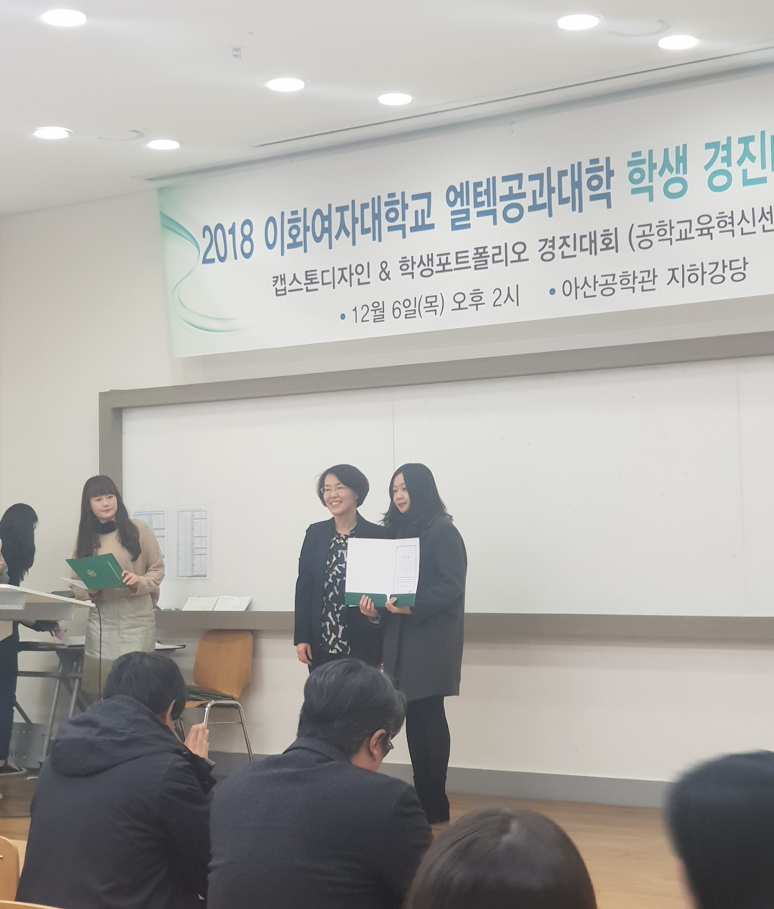

I am a MS student at Bioinformatics Laboratory led by Prof. Hyun-seok Park.   
My research interests include deep learning applications as well as natural language processing, especially in the biomedical domain.

### Interests

Bioinformatics, Natural Language Processing, and Machine Learning

### Research

### Teaching Assistant

### Education

**Ewha Womans Unviersity**, Seoul, Korea.  
Master of Science in Computer Science Engineering
Bachelor of Science in Computer Science Engineering

### Honors and Awards

Best Paper Award in Hanium Conference. 
 
2nd Place in Graduate Project Competition. 

2nd Place in Engineering Student Portfolio Contest. 
 


```markdown
Syntax highlighted code block

# Header 1
## Header 2
### Header 3

- Bulleted
- List

1. Numbered
2. List

**Bold** and _Italic_ and `Code` text

[Link](url) and 
```
